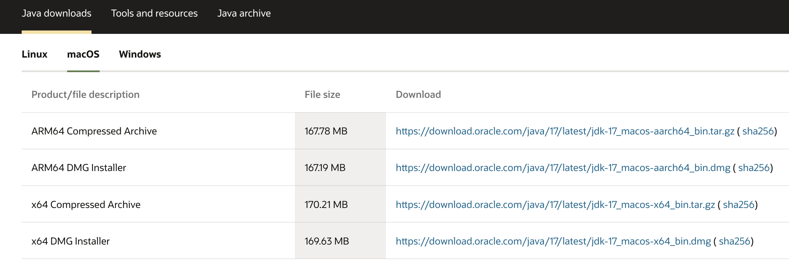
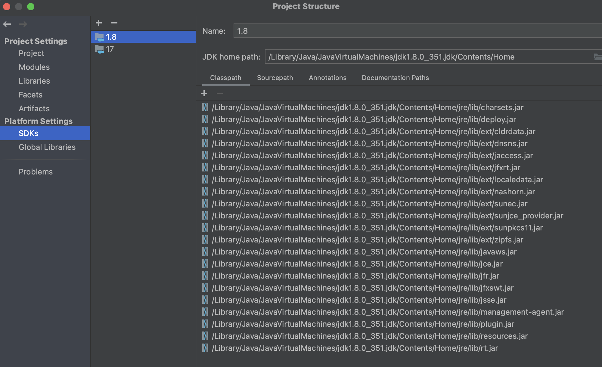
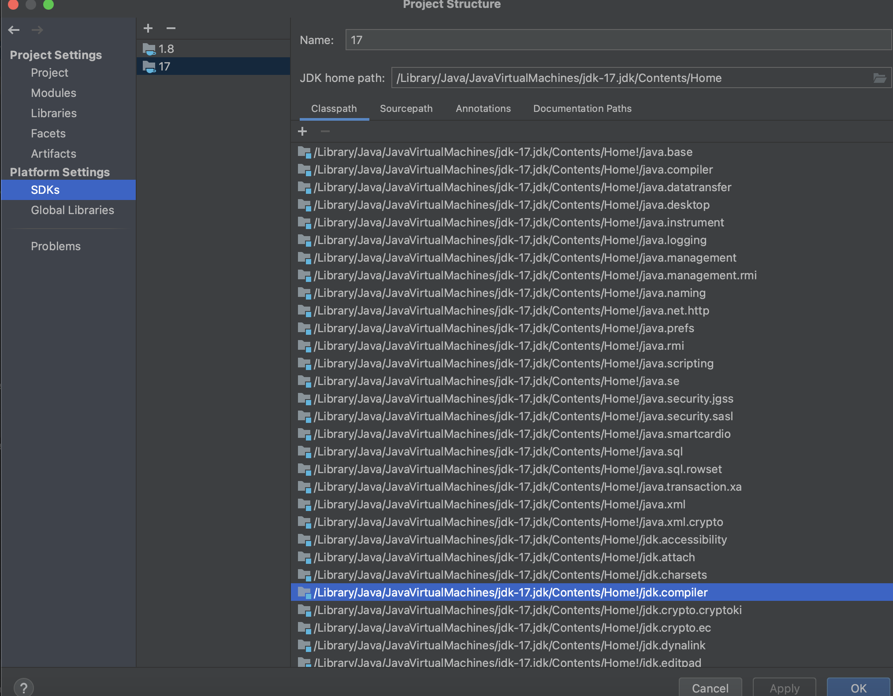

### step 1: download JDK 17
https://www.oracle.com/hk/java/technologies/downloads/#jdk17-mac

选择 ARM64 DMG Installer
### step 2: install JDK 17
双击下载的dmg按照指引安装JDK17，安装完后你在系统目录中可以看到jdk-17.jdk <br>
```
~ % java -version
java version "1.8.0_351"
Java(TM) SE Runtime Environment (build 1.8.0_351-b10)
Java HotSpot(TM) 64-Bit Server VM (build 25.351-b10, mixed mode)

~ % sudo ls /Library/Java/JavaVirtualMachines <br>
jdk-17.jdk		jdk1.8.0_351.jdk

~ % java -version
java version "17.0.7" 2023-04-18 LTS
Java(TM) SE Runtime Environment (build 17.0.7+8-LTS-224)
Java HotSpot(TM) 64-Bit Server VM (build 17.0.7+8-LTS-224, mixed mode, sharing)
```
### step 3: 配置JDK
```
~ % vim ~/.bash_profile 
# Java Config
export JAVA_8_HOME="/Library/Java/JavaVirtualMachines/jdk1.8.0_351.jdk/Contents/Home"
export JAVA_17_HOME="/Library/Java/JavaVirtualMachines/jdk-17.jdk/Contents/Home"


# config alias
alias jdk8="export JAVA_HOME=$JAVA_8_HOME"
alias jdk17="export JAVA_HOME=$JAVA_17_HOME"

# config default JDK
export JAVA_HOME=$JAVA_17_HOME
export PATH="$JAVA_HOME:$PATH"

~ % source ~/.bash_profile
~ % jdk17
~ % java -version
~ % jdk8
~ % java -version
```

### 配置IDEA
File -> project setting -> SDK



refer to
- https://blog.csdn.net/wo541075754/article/details/115283006
- https://www.oracle.com/hk/java/technologies/downloads/#java17