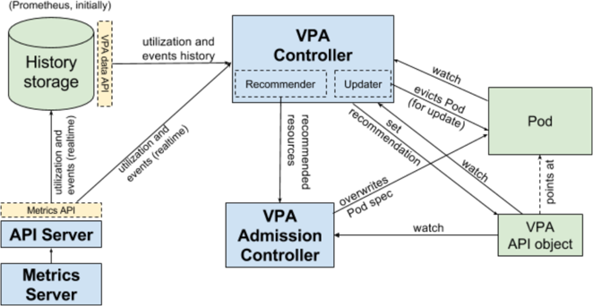

# What is VPA
- VPA sets up resource requests for the containers in the pod based on usage.
- VPA can down-scale pods that are over-requesting resource to improve resource utilization.
- VPA can up-scale pods that are under-requesting resources to avoid eviction or performance degradation.

## VPA architecture overview


## VPA input
- Events: OOM
- Metrics: /apis/metrics.k8s.io/v1beta1/namespaces/{namespace}/pods/{pod}
- History:
  - rate(container_cpu_usage_seconds_total{}[1h]
  - container_memory_working_set_bytes{}

### VPA input - history 

```
•rate(container_cpu_usage_seconds_total{}[1h])
•Start: now-8d
•End: now
•Step: 1h
```


