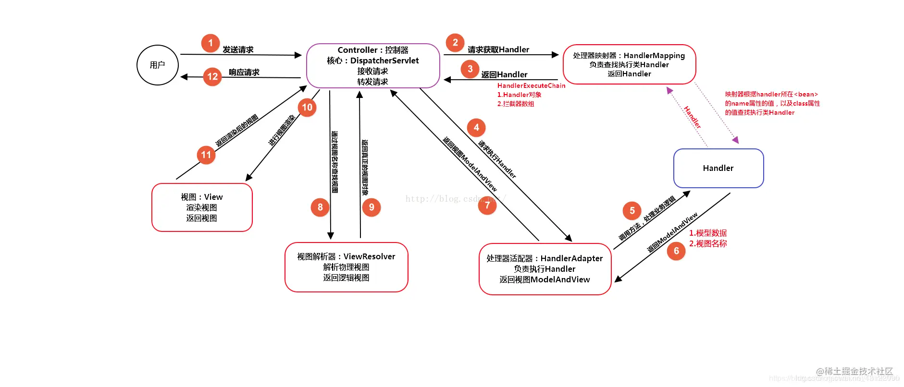

# 问题1：tomcat 和 servlet 之间是什么关系？
- tomcat是Web应用服务器，是一个servlet容器，负责处理客户请求，把请求传送给servlet并将servlet回应传送回客户。             
- servlet是一种J2EE规范，是JAVA的一个接口，扩展Java作为Web服务的功能。

tomcat和servlet之间的交互
1. Tomcat将http请求文本接收并解析，然后封装成HttpServletRequest类型的request对象，所有的HTTP头数据读可以通过request对象调用对应的方法查询到。
2. Tomcat同时会要响应的信息封装为HttpServletResponse类型的response对象，通过设置response属性就可以控制要输出到浏览器的内容，然后将response交给tomcat，tomcat就会将其变成响应文本的格式发送给浏览器。

servlet的生命周期：
1. init(), servlet初始化时候调用一次init方法。
2. service()，在运行过程中每次http请求就调用service方法。
3. destroy()，servlet销毁时点用一次destroy方法。

# 问题2： servlet 和 Spring MVC 之间的关系是什么？
DispatcherServlet中有一个WebApplicationContext对象, 该对象就是Spring Bean容器，里面包括一系列的Controller Bean等。

# 问题3： springMVC/Dispatcher 工作流程是什么？

1. 用户发送请求至前端控制器DispatcherServlet；
2. DispatcherServlet收到请求后，调用HandlerMapping处理器映射器，请求获取Handle；
3. 处理器映射器根据请求url找到具体的处理器，生成处理器对象及处理器拦截器(如果有则生成)一并返回给DispatcherServlet；
4. DispatcherServlet 调用 HandlerAdapter处理器适配器；
5. HandlerAdapter 经过适配调用 具体处理器(Handler，也叫后端控制器)；
6. Handler执行完成返回ModelAndView；
7. HandlerAdapter将Handler执行结果ModelAndView返回给DispatcherServlet；
8. DispatcherServlet将ModelAndView传给ViewResolver视图解析器进行解析；
9. ViewResolver解析后返回具体View；
10. DispatcherServlet对View进行渲染视图（即将模型数据填充至视图中）
11. DispatcherServlet响应用户
                                     
# 问题4：interceptor vs filter vs listener

参考：https://blog.csdn.net/zzhongcy/article/details/102498081

简单来说，
- filter 依赖于servlet容器 能拿到http信息，拿不到处理请求方法的信息
- interceptor 依赖于Spring容器 能拿到http信息 和 处理请求方法的信息， 拿不到方法的参数信息
- aspect 拿不到http信息， 能拿到方法参数信息