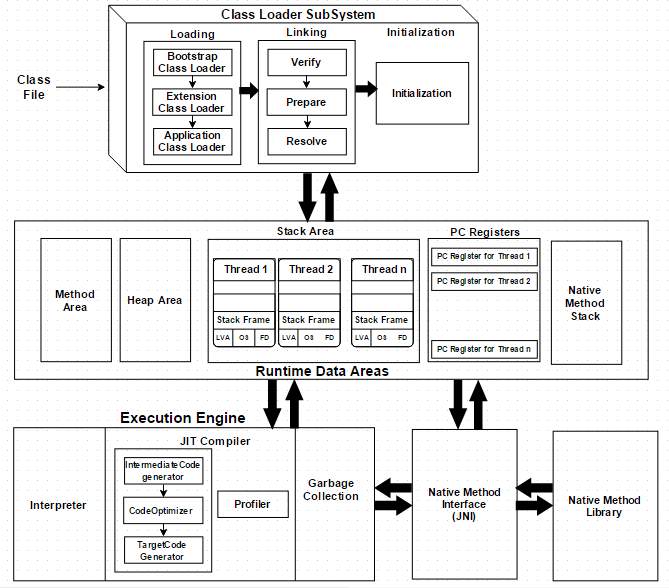

# 19.1 说一下 jvm 的主要组成部分？及其作用？
JVM主要包含四部分：
- 类加载器(ClassLoader)
- 运行时数据区(Runtime Data Area)
- 执行引擎(Execution Engine)
- 本地库接口(Native Method Interface JNI)

JVM主要组成部分参考下图

## 19.1.1 类加载器是什么？有哪些？
类加载器（ClassLoader)是java运行环境（JRE）的一部分，它动态的把java源文件编译后的字节码文件加载到JVM中。

类加载器分为:
- 启动类加载器(bootstrap):  加载JDK中的核心类库
- 扩展类加载器(extension): ，加载（java.ext.dir）JAVA_HOME/jre/lib/ext目录下的jar包 
- 系统类加载器(application): ，加载java命令中的classpath或者其它系统属性所指定的jar类包和类路径
- 自定义加载器(customer)：自定义加载器
- 线程上下文加载器
  

一个重要组件，它把Java源文件编译后的字节码文件加载到内存生成一个对应的类

## 19.1.2 类加载器是怎么加载类的？

## 19.1.3 类加载器双亲委派模型和线程上下文加载器

## 19.1.4 类加载器在框架中如何使用的？

java代码*.java,先通过javac编译出*.class文件，然后JVM的class loader负责把其加载到虚拟机。
  - 加载过程分为：
    - 1.1 loading: 加载到内存中
    - 1.2 linking-verification: 校验是否符合class文件标准
    - 1.3 linking-preparation: 类文件静态变量赋默认值 （注意不是初始值）
    - 1.4 linking-resolution: 把class文件常量池中用到的符号引用转换成直接内存地址
    - 1.5 initialzing： 静态变量赋初始值，静态块执行
  - 类加载器分层：
    - bootstrap: 启动类加载器 加载JDK中的核心类库
    - extension: 扩展类加载器，加载（java.ext.dir）JAVA_HOME/jre/lib/ext目录下的jar包 
    - application: 系统类加载器，加载java命令中的classpath或者其它系统属性所指定的jar类包和类路径
    - customer：自定义加载器
  - 采用双亲委派加载模式：就是先判断是否加载：判断从自定以加载器开始逐级到bootstrap。如果没有加载，则开始加载：加载顺序是从bootstrap开始逐级到customer 
  - 类加载带来的动态特性: tomcat/glassfish等使用classload实现了应用隔离，通过OSGI实现模块可插拔。
- 执行引擎 (Execution Engine)
  - 解释器
  - JIT编译器
  - 垃圾收集器：搜集并删除未引用的对象
- 本地库接口(Native Interface)
- 运行时数据区(Runtime Data Area)
  - 方法区/堆为线程共享，栈/本地方法栈/程序计数器为线程独享。方法区存类级别信息（类，常量，静态变量），堆区存对象级别信息，栈存局部变量和对象的引用。
  - 方法区：JDK7之前成为永久代，使用JVM内存,(JVM PermSize/MaxPermSize); JDK8开始使用元空间,直接使用本地内存,可以限制也可以不限制大小（限制使用：MetaspaceSize/MaxMetaspaceSize)。 当然超出内存会出现OOM:"PermGen space" 或者 OOM:"Metaspace"。 往往是加载了大量的第三方包，部署的应用过多，大量动态生成的反射类, 或者类加载器泄漏等等原因导致的。 注意两点：1）静态变量存在方法区，2）不同于其它常量，JDK8后字符串常量已经从方法区移到堆区了
  - 堆区
    - 新生代：eden+from+to, 垃圾回收minorGC采用复制算法。eden内存不足时触发一次minorGC. 多次(默认15次）minorGC后仍然存活的就进入老年代。
    - 老年代: 垃圾回收majorGC采用标记-清除/整理算法. 老年代不足分配大对象，或者接受从新生代晋升的对象时就会触发一次。
    - 常见的JVM参数
      - -XX:+UseContainerSupport
      - -Xmx1g   // JVM最大堆大小，例子1G，默认物理内存1/4， 优先级高于MaxRAMPercentage
      - -Xms1g   // JVM初始堆大小，例子1G，默认物理内存1/64 
      - -XX:SurvivorRatio=8  // JVM堆的新生代中eden:survivor=1:8, 说明80%为eden区，两个survivor每个为10%为
      - -XX:NewRatio=2    // JVM堆的新生代：老年代=1：2，说明新生代占堆的1/3
      - -XX:PermSize=256m    // JVM 初始永久代大小，例子256M，默认物理内存1/64 （JDK8+已移除）
      - -XX:MaxPermSize=256m // JVM 最大永久代大小，例子256M，默认物理内存1/4  （JDK8+已移除）
      - -XX:MetaspaceSize=256m    // JVM 初始元空间（永久代）大小，例子256M
      - -XX:MaxMetaspaceSize=256m // JVM 最大元空间（永久代）大小，例子256M，默认可以是物理内存大小
      - -XX:MaxRAMPercentage=75.0  // JVM堆最大占容器内存的75%
      - -Xss1m   // JVM线程栈大小，例子1M，默认1M
      - -XX:MaxDirectMemorySize=1G   //JVM直接内存（堆外内存）最大大小，例子1G，默认与Xmx（堆）相同
      - -XX:SoftRefLRUPolicyMSPerMB=50 //每1M空闲内存，允许软引用存活50毫秒
      - -Xlog:gc
      - -XX:+PrintGCDetails
      - -XX:+HeapDumpOnOutOfMemoryError   // 内存溢出时生成dump文件
      - -XX:HeapDumpPath=/path/to/heapdump.hprof  // dump文件存储路径，需要在pod上挂载persistent volume
      - -XX:+UseG1GC // JDK9+ 默认配置
      - -XX:G1HeapRegionSize //G1 单个区域的大小（1M到32M之间），总区域有2048个，支持堆2G到64G
      - -XX:MaxGCPauseMillis //设置回收的最大时间
      - -XX:ParallelGCThreads //设置并行垃圾回收线程
      - https://cloud.tencent.com/developer/article/2410830 G1 垃圾收集器
    - 总内存=堆内存+栈大小*线程数+方法区+本地内存
    - FullGC: 垃圾回收整个堆包括新生代+老年代+永久代（如果有）
    - 回收：强引用（永不回收）> 软引用(内存不足回收) > 弱引用（下次GC回收）> 虚引用（回收时通知）
    - 垃圾回收算法有哪些：
      - 标记清除（Mark-sweep)：简单，有碎片
      - 标记复制（Mark-copy)：无碎片，有一半空闲
      - 标记整理（Mark-compact)：无碎片，移动对象开销大
      - 分代回收（Generation Collection）：堆中不同的代采用不同的回收算法
        - 新生代垃圾回收算法有：Serial, Parallel Scavenge
        - 老年代垃圾回收算法有：Serial Old， Parallel Old， CMS（concurrent Mark-Sweep)
        - 整个堆的垃圾回收算法有：G1（Garbage-First），ZGC，Shenandoah
  - 栈/本地方法栈/程序计数器
    - 

