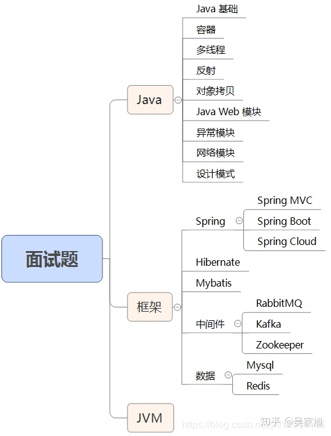

[java 面试题@知乎](https://zhuanlan.zhihu.com/p/90026505)

一、Java 基础
二、容器
三、多线程
四、反射
五、对象拷贝
六、Java Web
七、异常
八、网络
九、设计模式
十、Spring/Spring MVC
十一、Spring Boot/Spring Cloud
十二、Hibernate
十三、Mybatis
十四、RabbitMQ
十五、Kafka
十六、Zookeeper
十七、MySql
## 18 Redis

## 19 JVM
### 19.1 说一下 jvm 的主要组成部分？及其作用？

